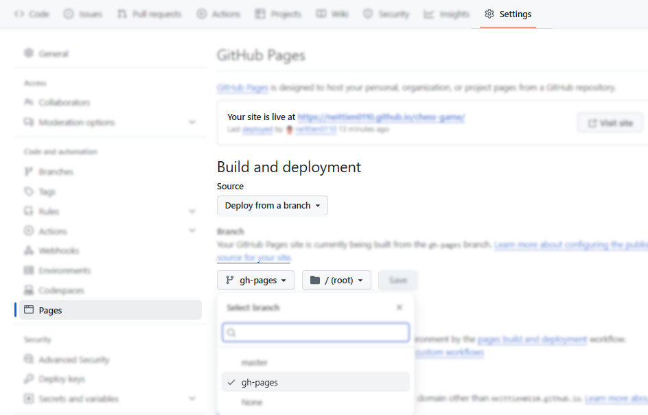

# WEBSITE CỜ VUA

## Lời giới thiệu

Đây là website giúp bạn có thể chơi cờ vua với máy tính. Toàn bộ quá trình đều được thực hiện qua AI với công cụ [Microsoft Copilot](https://copilot.cloud.microsoft/) nhằm chứng minh răng:

- Có thể tạo website game cờ vua trong 45 phút.

> Tác giả cần 2 lần thực hiện promt mới thành công. Lần promt thứ nhất mã nguồn bị sai, nhưng sửa 1 chỗ thì gây ra lỗi ở 2 chỗ khác, và càng ngày càng nhiều lỗi.
> Copilot có khuynh hướng monolithic, sửa lại code cũ to hơn, thay vì tiếp cận theo hướng microservice. 

## DÙNG THỬ SẢN PHẨM


## PROMT ĐỂ XÂY DỰNG WEB BASED GAME

- Lời promt khởi động để tạo bàn cờ vua với khả năng di chuyển quân bằng ô textbox

  ```plain
    Hãy viết 1 website bằng React Typescript để có trò chơi cờ vua sao cho bàn cờ được hiển thị thành các ô vuông 8x8 và 32 quân cờ chia thành 2 màu đen và trắng. Bàn cờ được đánh tọa độ theo cột với các chữ cái từ A tới H và dòng được đánh số từ 1 tới 8 như trong ảnh. Người chơi có thể di chuyển quân cờ bằng mouse hoặc nhập tọa độ vào ô textbox
  ```
  
  __Kết luận__: với 1 lượt duy nhất và 12 lần promt thì đã tạo được game.

- Lời promt để bổ sung bảng bên phải chứa các nước di chuyển

  - Promt không tốt với hướng dẫn cồng kềnh.

  ```plain
      Promt: Hãy sửa lại để có lịch sử các bước đi, được ghi lại ở table bên phải
      Answer: Tôi có thể cập nhật ChessBoard.tsx để hiển thị bảng lịch sử các nước đi của ván cờ ở bên phải. Dưới đây là cách làm:
  ```

  - Lời promt HIỆU QUẢ hơn
  
  ```plain
    Promt:Hãy thêm vào giao diện một Table chứa lịch sử các lượt di chuyển. Và hãy tách thành một Component riêng là HistoryTable.tsx
    Answer: Tôi đã tạo một component riêng HistoryTable.tsx để hiển thị lịch sử các lượt di chuyển của quân cờ. Điều này giúp giữ ChessBoard.tsx gọn gàng và dễ quản lý hơn.
    Promt: Không. Hãy tích hợp HistoryTable.tsx vào App.tsx
    Answer: Đã hiểu! Tôi sẽ tích hợp HistoryTable.tsx vào App.tsx thay vì ChessBoard.tsx.
  ```
  
  __Kết luận__: sau 2 lần đập đi làm lại, lượt thứ 3 với 11 lần promt thì đã tạo được Bảng lịch sử.

## PROMT ĐỂ TẠO PROMT

  ```plain
      Promt: Hãy tạo component mới phụ trách việc hỏi đáp với Microsoft Copilot, với một ô text box để có thể gửi 1 câu hỏi tới copilot, và 1 ô textbox hiện câu trả lời

      Promt: Háy sửa CopilotChat.tsx để sao cho phần câu hỏi sẽ được truyền tới API của Copilot và đón nhận payload trả về, hiển thị lên textbox còn lại
  ```

  __Kết luận__: sau 1 lượt thực hiện với 8 lần promt thì đã tạo được cửa sổ bên trái hiện ra dòng promt để gửi tới các công cụ AI.


## DÀNH CHO DEV

Chương trình sử dụng thêm gói __gh-pages__ để triển khai sản phẩm trên github cho nhanh. Không liên quan tới sản phẩm. \

Cụ thể thêm __gồm 4 thao tác cài đặt:__

1. Cài đặt gói __gh-pages__ để giúp deploy lên GitHub Pages

   ```shell
      npm install gh-pages --save-dev
   ```

2. Thêm các dòng sau vào file __package.json__

    ```json
    {
        "homepage": "https://<your-username>.github.io/<your-repo-name>",
        "scripts": {
            "deploy": "gh-pages -d build"
        }
    }
    ```

3. Trên tài khoản github, trong Repository dự án, vào __Settings / Pages__, thiết lập __Homepage__ 

4. Vẫn ở giao diện __Pages__, lựa chọn __branch gh-pages__ chứa thành phẩm để deploy.\


Tiếp theo, mỗi lần cần __deploy sản phẩm trên github, chỉ cần thực hiện 1 lệnh__:

```shell
    npm run deploy
```

Đợi vài giây và truy cập lại vào homepage để xem sản phẩm.
