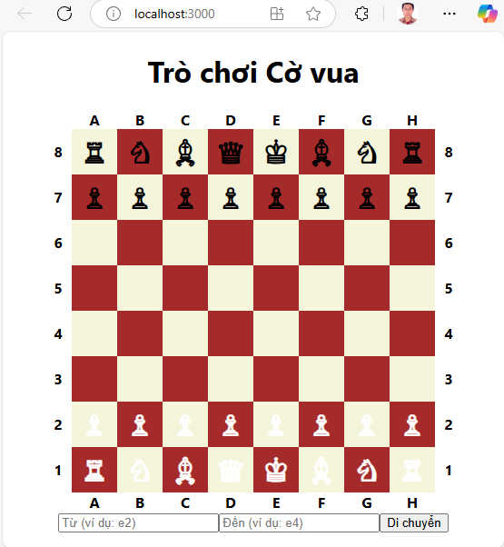

# WEBSITE CỜ VUA

## Lời giới thiệu

Đây là website giúp bạn có thể chơi cờ vua với máy tính. Toàn bộ quá trình đều được thực hiện qua AI với công cụ [Microsoft Copilot](https://copilot.cloud.microsoft/) nhằm chứng minh răng:

- Có thể tạo website game cờ vua trong 45 phút.

> Tác giả cần 2 lần thực hiện promt mới thành công. Lần promt thứ nhất mã nguồn bị sai, nhưng sửa 1 chỗ thì gây ra lỗi ở 2 chỗ khác, và càng ngày càng nhiều lỗi.

## DÙNG THỬ SẢN PHẨM



## PROMT ĐỂ XÂY DỰNG WEBSITE

- Lời promt khởi động

  ```plain
    Hãy viết 1 website bằng React Typescript để có trò chơi cờ vua sao cho bàn cờ được hiển thị thành các ô vuông 8x8 và 32 quân cờ chia thành 2 màu đen và trắng. Bàn cờ được đánh tọa độ theo cột với các chữ cái từ A tới H và dòng được đánh số từ 1 tới 8 như trong ảnh. Người chơi có thể di chuyển quân cờ bằng mouse hoặc nhập tọa độ vào ô textbox
  ```

## DÀNH CHO DEV

Chương trình sử dụng thêm gói __gh-pages__ để triển khai sản phẩm trên github cho nhanh. Không liên quan tới sản phẩm. \

Cụ thể thêm __gồm 4 thao tác cài đặt:__

1. Cài đặt gói __gh-pages__ để giúp deploy lên GitHub Pages

   ```shell
      npm install gh-pages --save-dev
   ```

2. Thêm các dòng sau vào file __package.json__

    ```json
    {
        "homepage": "https://<your-username>.github.io/<your-repo-name>",
        "scripts": {
            "deploy": "gh-pages -d build"
        }
    }
    ```

3. Trên tài khoản github, trong Repository dự án, vào __Settings / Pages__, thiết lập __Homepage__ 

4. Vẫn ở giao diện __Pages__, lựa chọn __branch gh-pages__ chứa thành phẩm để deploy.\


Tiếp theo, mỗi lần cần __deploy sản phẩm trên github, chỉ cần thực hiện 1 lệnh__:

```shell
    npm run deploy
```

Đợi vài giây và truy cập lại vào homepage để xem sản phẩm.
